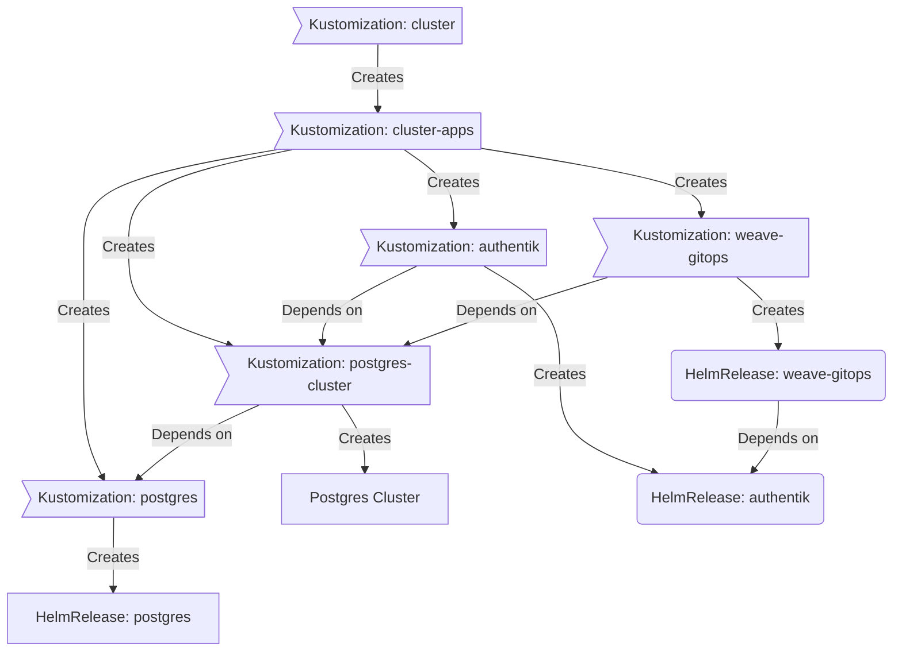

<div align="center">


### My Home Operations Repository :octocat:

_... managed with Flux, Renovate, and GitHub Actions_ 🤖

</div>

<div align="center">

[](https://www.talos.dev/)&nbsp;&nbsp;
[](https://github.com/tparker00/k3s-home/actions/workflows/renovate.yaml)

</div>

<div align="center">

[](https://status.hamcloud.io)&nbsp;&nbsp;
[](https://status.hamcloud.io/endpoints/external_gatus)&nbsp;&nbsp;
[](https://status.hamcloud.io/endpoints/external_plex)

</div>

<div align="center">

[](https://github.com/kashalls/kromgo/)&nbsp;&nbsp;
[](https://github.com/kashalls/kromgo/)&nbsp;&nbsp;
[](https://github.com/kashalls/kromgo/)&nbsp;&nbsp;
[](https://github.com/kashalls/kromgo/)&nbsp;&nbsp;
[](https://github.com/kashalls/kromgo/)&nbsp;&nbsp;
[](https://github.com/kashalls/kromgo/)&nbsp;&nbsp;

</div>

---

## 📖 Overview

This is a mono repository for my home infrastructure and Kubernetes cluster. I try to adhere to Infrastructure as Code (IaC) and GitOps practices using tools like [Ansible](https://www.ansible.com/), [Terraform](https://www.terraform.io/), [Kubernetes](https://kubernetes.io/), [Flux](https://github.com/fluxcd/flux2), [Renovate](https://github.com/renovatebot/renovate), and [GitHub Actions](https://github.com/features/actions).

---

## ⛵ Kubernetes

There is a template over at [onedr0p/cluster-template](https://github.com/onedr0p/cluster-template) if you want to try and follow along with some of the practices I use here.

### Core Components

- [cert-manager](https://github.com/cert-manager/cert-manager): Creates SSL certificates for services in my cluster.
- [cilium](https://github.com/cilium/cilium): Internal Kubernetes container networking interface.
- [cloudflared](https://github.com/cloudflare/cloudflared): Enables Cloudflare secure access to certain ingresses.
- [external-dns](https://github.com/kubernetes-sigs/external-dns): Automatically syncs ingress DNS records to a DNS provider.
- [external-secrets](https://github.com/external-secrets/external-secrets/): managed Kubernetes secrets using [Bitwarden](https://bitwarden.com/).
- [ingress-nginx](https://github.com/kubernetes/ingress-nginx): Kubernetes ingress controller using NGINX as a reverse proxy and load balancer.
- [sops](https://github.com/getsops/sops): Managed secrets for Kubernetes and Terraform which are commited to Git.
- [tf-controller](https://github.com/weaveworks/tf-controller): Additional Flux component used to run Terraform from within a Kubernetes cluster.

### GitOps

[Flux](https://github.com/fluxcd/flux2) watches the clusters in my [kubernetes](./kubernetes/) folder (see Directories below) and makes the changes to my clusters based on the state of my Git repository.

The way Flux works for me here is it will recursively search the `kubernetes/apps` folder until it finds the most top level `kustomization.yaml` per directory and then apply all the resources listed in it. That aforementioned `kustomization.yaml` will generally only have a namespace resource and one or many Flux kustomizations (`ks.yaml`). Under the control of those Flux kustomizations there will be a `HelmRelease` or other resources related to the application which will be applied.

[Renovate](https://github.com/renovatebot/renovate) watches my **entire** repository looking for dependency updates, when they are found a PR is automatically created. When some PRs are merged Flux applies the changes to my cluster.

### Directories

This Git repository contains the following directories under [Kubernetes](./kubernetes/).

```sh
📁 kubernetes
  ├── 📁 apps           # applications
  ├── 📁 bootstrap      # bootstrap procedures
  ├── 📁 flux           # core flux configuration
  └── 📁 templates      # re-useable components
```

### Flux Workflow

This is a high-level look how Flux deploys my applications with dependencies. Below there are 3 apps `postgres`, `authentik` and `weave-gitops`. `postgres` is the first app that needs to be running and healthy before `authentik` and `weave-gitops`. Once `postgres` is healthy `authentik` will be deployed and after that is healthy `weave-gitops` will be deployed.



### Networking

<details>
  <summary>TODO</summary>
</details>

---

## ☁️ Cloud Dependencies

While most of my infrastructure and workloads are self-hosted I do rely upon the cloud for certain key parts of my setup. This saves me from having to worry about two things. (1) Dealing with chicken/egg scenarios and (2) services I critically need whether my cluster is online or not.

The alternative solution to these two problems would be to host a Kubernetes cluster in the cloud and deploy applications like [HCVault](https://www.vaultproject.io/), [Vaultwarden](https://github.com/dani-garcia/vaultwarden), [ntfy](https://ntfy.sh/), and [Gatus](https://gatus.io/). However, maintaining another cluster and monitoring another group of workloads is a lot more time and effort than I am willing to put in.

| Service                                         | Use                                                               | Cost           |
|-------------------------------------------------|-------------------------------------------------------------------|----------------|
| [Bitwarden](https://bitwarden.com/)             | Secrets with [External Secrets](https://external-secrets.io/)     | Free           |
| [Cloudflare](https://cloudflare.com/)           | DNS and Tunnel hosting                                            | Free           |
| [GitHub](https://github.com/)                   | Hosting this repository and continuous integration/deployments    | Free           |
| [Namecheap](https://namecheap.com/)             | Domain registration                                               | $45/yr         |
| [Proton](https://proton.com/)                   | Email hosting                                                     | $120/yr        |
| [Pushover](https://pushover.net/)               | Kubernetes Alerts and application notifications                   | $5 OTP         |
| [Slack](https://slack.com/)                     | Chat                                                              | Free           |
|                                                 |                                                                   | Total: ~$15/mo |

---

## 🌐 DNS

### Home DNS

On my Opnsense router I have [unbound](https://nlnetlabs.nl/projects/unbound). In my cluster `external-dns` is deployed with the `RFC2136` provider which syncs DNS records to `unbound`.

### Public DNS

Outside the `external-dns` instance mentioned above another instance is deployed in my cluster and configured to sync DNS records to [Cloudflare](https://www.cloudflare.com/). The only ingress this `external-dns` instance looks at to gather DNS records to put in `Cloudflare` are ones that have an ingress class name of `external` and contain an ingress annotation `external-dns.alpha.kubernetes.io/target`.

---

## 🔧 Hardware

| Device                      | Count | OS Disk Size | Data Disk Size               | Ram   | Operating System | Purpose                |
|-----------------------------|-------|--------------|------------------------------|-------|------------------|------------------------|
| Dell 7070 Micro             | 1     | 256GB SSD    |                              | 32GB  | Ubuntu LTS       | Kubernetes Controllers |
| HP ELITEDESK 800 G5 MINI    | 3     | 256GB SSD    |                              | 16GB  | Ubuntu LTS       | Kubernetes Workers     |
| VM                          | 2     | 100GB SSD    |                              | 32GB  | Ubuntu LTS       | Kubernetes Controller  |
| SMC Microtower Intel Atom   | 1     | 16Gb         | 47TB HDD Moosefs             | 16GB  | Ubuntu LTS       | Storage Server         |
| SMC MicroTower AMD Epyc     | 1     | 16Gb         | 2TB SSD                      | 32GB  | Proxmox          | VM Host
| Synology DS1821+            | 1     | -            | 4TB NVME, 98TB HDD Moosefs   | 32GB  | DSM 7.2          | VM Host/Storage Server |
| SMC 36 Bay Chass            | 1     | 64Gb         | 4TB NVME, 115TB HDD Moosefs  | 192GB | Proxmox          | VM Host/Storage        |
| Qotom Q355G4                | 1     | 256GB NVMe   | -                            | 8GB   | Opnsense         | Router                 |
| Mikrotik CSS610-8G-2S+IN    | 1     | -            | -                            | -     | -                | 10Gb Switch            |
| Aruba S2500                 | 1     | -            | -                            | -     | -                | 1Gb PoE Switch         |
| Cyberpower CP1500AVRLCD3    | 2     | -            | -                            | -     | -                | UPS                    |

---

## 🤝 Gratitude and Thanks

Thanks to all the people who donate their time to the [Home Operations](https://discord.gg/home-operations) Discord community. Be sure to check out [kubesearch.dev](https://kubesearch.dev/) for ideas on how to deploy applications or get ideas on what you may deploy.
